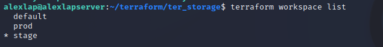

# Домашнее задание к занятию "7.3. Основы и принцип работы Терраформ"

## Задача 1. Создадим бэкэнд в S3 (необязательно, но крайне желательно).

Если в рамках предыдущего задания у вас уже есть аккаунт AWS, то давайте продолжим знакомство со взаимодействием
терраформа и aws. 

1. Создайте s3 бакет, iam роль и пользователя от которого будет работать терраформ. Можно создать отдельного пользователя,
а можно использовать созданного в рамках предыдущего задания, просто добавьте ему необходимы права, как описано 
[здесь](https://www.terraform.io/docs/backends/types/s3.html).
1. Зарегистрируйте бэкэнд в терраформ проекте как описано по ссылке выше. 


## Задача 2. Инициализируем проект и создаем воркспейсы. 

1. Выполните `terraform init`:
    * если был создан бэкэнд в S3, то терраформ создат файл стейтов в S3 и запись в таблице 
dynamodb.
    * иначе будет создан локальный файл со стейтами.  
1. Создайте два воркспейса `stage` и `prod`.
1. В уже созданный `aws_instance` добавьте зависимость типа инстанса от вокспейса, что бы в разных ворскспейсах 
использовались разные `instance_type`.
1. Добавим `count`. Для `stage` должен создаться один экземпляр `ec2`, а для `prod` два. 
1. Создайте рядом еще один `aws_instance`, но теперь определите их количество при помощи `for_each`, а не `count`.
1. Что бы при изменении типа инстанса не возникло ситуации, когда не будет ни одного инстанса добавьте параметр
жизненного цикла `create_before_destroy = true` в один из рессурсов `aws_instance`.
1. При желании поэкспериментируйте с другими параметрами и рессурсами.

В виде результата работы пришлите:
* Вывод команды `terraform workspace list`.

.

* Вывод команды `terraform plan` для воркспейса `prod`.
```commandline
alexlap@alexlapserver:~/terraform/ter_storage$ terraform plan

Terraform used the selected providers to generate the following execution plan. Resource actions are indicated with the following symbols:
  + create

Terraform will perform the following actions:

  # yandex_compute_image.my_image will be created
  + resource "yandex_compute_image" "my_image" {
      + created_at      = (known after apply)
      + folder_id       = (known after apply)
      + id              = (known after apply)
      + min_disk_size   = (known after apply)
      + name            = "my-centos"
      + os_type         = (known after apply)
      + pooled          = (known after apply)
      + product_ids     = (known after apply)
      + size            = (known after apply)
      + source_disk     = (known after apply)
      + source_family   = "ubuntu-1804-lts"
      + source_image    = (known after apply)
      + source_snapshot = (known after apply)
      + source_url      = (known after apply)
      + status          = (known after apply)
    }

  # yandex_compute_instance.default["node01"] will be created
  + resource "yandex_compute_instance" "default" {
      + allow_stopping_for_update = true
      + created_at                = (known after apply)
      + folder_id                 = (known after apply)
      + fqdn                      = (known after apply)
      + hostname                  = (known after apply)
      + id                        = (known after apply)
      + name                      = "node01"
      + network_acceleration_type = "standard"
      + platform_id               = "standard-v1"
      + service_account_id        = (known after apply)
      + status                    = (known after apply)
      + zone                      = "ru-central1-a"

      + boot_disk {
          + auto_delete = true
          + device_name = (known after apply)
          + disk_id     = (known after apply)
          + mode        = (known after apply)

          + initialize_params {
              + block_size  = (known after apply)
              + description = (known after apply)
              + image_id    = (known after apply)
              + name        = (known after apply)
              + size        = 10
              + snapshot_id = (known after apply)
              + type        = "network-nvme"
            }
        }

      + network_interface {
          + index              = (known after apply)
          + ip_address         = "192.168.101.11"
          + ipv4               = true
          + ipv6               = (known after apply)
          + ipv6_address       = (known after apply)
          + mac_address        = (known after apply)
          + nat                = true
          + nat_ip_address     = (known after apply)
          + nat_ip_version     = (known after apply)
          + security_group_ids = (known after apply)
          + subnet_id          = (known after apply)
        }

      + placement_policy {
          + host_affinity_rules = (known after apply)
          + placement_group_id  = (known after apply)
        }

      + resources {
          + core_fraction = 100
          + cores         = 4
          + memory        = 8
        }

      + scheduling_policy {
          + preemptible = (known after apply)
        }
    }

  # yandex_compute_instance.default["node02"] will be created
  + resource "yandex_compute_instance" "default" {
      + allow_stopping_for_update = true
      + created_at                = (known after apply)
      + folder_id                 = (known after apply)
      + fqdn                      = (known after apply)
      + hostname                  = (known after apply)
      + id                        = (known after apply)
      + name                      = "node02"
      + network_acceleration_type = "standard"
      + platform_id               = "standard-v1"
      + service_account_id        = (known after apply)
      + status                    = (known after apply)
      + zone                      = "ru-central1-a"

      + boot_disk {
          + auto_delete = true
          + device_name = (known after apply)
          + disk_id     = (known after apply)
          + mode        = (known after apply)

          + initialize_params {
              + block_size  = (known after apply)
              + description = (known after apply)
              + image_id    = (known after apply)
              + name        = (known after apply)
              + size        = 10
              + snapshot_id = (known after apply)
              + type        = "network-nvme"
            }
        }

      + network_interface {
          + index              = (known after apply)
          + ip_address         = "192.168.101.12"
          + ipv4               = true
          + ipv6               = (known after apply)
          + ipv6_address       = (known after apply)
          + mac_address        = (known after apply)
          + nat                = true
          + nat_ip_address     = (known after apply)
          + nat_ip_version     = (known after apply)
          + security_group_ids = (known after apply)
          + subnet_id          = (known after apply)
        }

      + placement_policy {
          + host_affinity_rules = (known after apply)
          + placement_group_id  = (known after apply)
        }

      + resources {
          + core_fraction = 100
          + cores         = 4
          + memory        = 8
        }

      + scheduling_policy {
          + preemptible = (known after apply)
        }
    }

  # yandex_vpc_network.default will be created
  + resource "yandex_vpc_network" "default" {
      + created_at                = (known after apply)
      + default_security_group_id = (known after apply)
      + folder_id                 = (known after apply)
      + id                        = (known after apply)
      + labels                    = (known after apply)
      + name                      = "net"
      + subnet_ids                = (known after apply)
    }

  # yandex_vpc_subnet.default will be created
  + resource "yandex_vpc_subnet" "default" {
      + created_at     = (known after apply)
      + folder_id      = (known after apply)
      + id             = (known after apply)
      + labels         = (known after apply)
      + name           = "subnet"
      + network_id     = (known after apply)
      + v4_cidr_blocks = [
          + "192.168.101.0/24",
        ]
      + v6_cidr_blocks = (known after apply)
      + zone           = "ru-central1-a"
    }

Plan: 5 to add, 0 to change, 0 to destroy.

Changes to Outputs:
  + yandex_compute_image_my_image_id = (known after apply)
  + yandex_vpc_network_net_name      = "net"
  + yandex_vpc_subnet_subnet_name    = "subnet"

```
### Созданные ресурсы

.

.

### Конфигyрация

- разные настройки для разных сред;
- применен цикл foreach;
- использован параметр `create_before_destroy = true`.

```commandline
# Main

locals {
instance_cores_map = {
 stage = 2
 prod = 4
}
instance_memory_map = {
 stage = 4
 prod = 8
}
instances = {
 "node01" = "192.168.101.11"
 "node02" = "192.168.101.12"
}
}

resource "yandex_compute_image" "my_image" {
  name = "my-centos"
  source_family = "ubuntu-1804-lts"
}

resource "yandex_compute_instance" "default" {
for_each = local.instances

  name                      = each.key
  zone                      = "ru-central1-a"
  allow_stopping_for_update = true

resources{
cores = local.instance_cores_map[terraform.workspace]
memory = local.instance_memory_map[terraform.workspace]
}

  boot_disk {
    initialize_params {
      image_id    = "${yandex_compute_image.my_image.id}"
      type        = "network-nvme"
      size        = "10"
    }
  }

  network_interface {
    subnet_id  = "${yandex_vpc_subnet.default.id}"
    nat        = true
    ip_address = each.value
  }

lifecycle {
 create_before_destroy = true
 }

}

# Network
resource "yandex_vpc_network" "default" {
  name = "net"
}

resource "yandex_vpc_subnet" "default" {
  name = "subnet"
  zone           = "ru-central1-a"
  network_id     = "${yandex_vpc_network.default.id}"
  v4_cidr_blocks = ["192.168.101.0/24"]
}output "yandex_vpc_network_net_name" {
  value = "${yandex_vpc_network.default.name}"
}

output "yandex_vpc_subnet_subnet_name" {
  value = "${yandex_vpc_subnet.default.name}"
}

output "yandex_compute_image_my_image_id" {
  value = "${yandex_compute_image.my_image.id}"
}

# Provider
terraform {
  required_providers {
    yandex = {
      source = "yandex-cloud/yandex"
    }
  }

required_version = ">= 0.13"

backend "s3" {
    endpoint   = "storage.yandexcloud.net"
    bucket     = "new-backet"
    region     = "ru-central1"
    key        = "main-infra/terraform.tfstate"
    access_key = "###"
    secret_key = "###"

    skip_region_validation      = true
    skip_credentials_validation = true
 }
}

provider "yandex" {
  token="AQAAAAADyExUAATuwT-0mnKAl0vNj7fWtdnrB6M"
  cloud_id  = "${var.yandex_cloud_id}"
  folder_id = "${var.yandex_folder_id}"
  zone      = "ru-central1-a"
}

# Variables
# Заменить на ID своего облака
variable "yandex_cloud_id" {
  default = "b1ggkmuus3v8crqep3mr"
}

# Заменить на Folder своего облака
# https://console.cloud.yandex.ru/cloud?section=overview
variable "yandex_folder_id" {
  default = "b1gc7oihnk341ura7qfc"
}
```