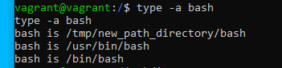

# Домашнее задание к занятию "3.1. Работа в терминале, лекция 1"

1. "УСТАНОВЛЕНО" Установите средство виртуализации [Oracle VirtualBox](https://www.virtualbox.org/).

2. "УСТАНОВЛЕНО" Установите средство автоматизации [Hashicorp Vagrant](https://www.vagrantup.com/).

3. "УСТАНОВЛЕНО" В вашем основном окружении подготовьте удобный для дальнейшей работы терминал. Можно предложить:
    * iTerm2 в Mac OS X
    * Windows Terminal в Windows
    * выбрать цветовую схему, размер окна, шрифтов и т.д.
    * почитать о кастомизации PS1/применить при желании.

    
4. "ВЫПОЛНЕНО" С помощью базового файла конфигурации запустите Ubuntu 20.04 в VirtualBox посредством Vagrant:
    
5. "ВЫПОЛНЕНО" Ознакомьтесь с графическим интерфейсом VirtualBox, посмотрите как выглядит виртуальная машина, которую создал для вас Vagrant, какие аппаратные ресурсы ей выделены. Какие ресурсы выделены по-умолчанию?

6. "ВЫПОЛНЕНО" Ознакомьтесь с возможностями конфигурации VirtualBox через Vagrantfile: [документация](https://www.vagrantup.com/docs/providers/virtualbox/configuration.html). Как добавить оперативной памяти или ресурсов процессора виртуальной машине?

7. "ВЫПОЛНЕНО" Команда `vagrant ssh` из директории, в которой содержится Vagrantfile, позволит вам оказаться внутри виртуальной машины без каких-либо дополнительных настроек. Попрактикуйтесь в выполнении обсуждаемых команд в терминале Ubuntu.

8. Ознакомиться с разделами `man bash`, почитать о настройках самого bash:
    * ОТВЕТ: (HISTSIZE 862 строка) какой переменной можно задать длину журнала `history`, и на какой строчке manual это описывается?
    * ОТВЕТ: (используется для настройки HISTCONTROL, `ignoreboth` устанавливает одновременно 
   два правила для истории:
   - Ignoredups — не писать строку после команды дублирования строки;
   - Ignorespace — не писать строки, начинающиеся с одного или нескольких пробелов в истории.) 
   что делает директива `ignoreboth` в bash?
   
9. ОТВЕТ: (508 строчка, используются для создания коллекции входящих аргументов. Например: touch {1..100000}_file - создаст 100 тыс файлов) В каких сценариях использования применимы скобки `{}` и на какой строчке `man bash` это описано?
10. ОТВЕТ: (touch {1..100000}_file, 300 тыс не получится потому что есть ограничение на максимальное число аргументов, зависит от ОС, Argument list too long) Основываясь на предыдущем вопросе, как создать однократным вызовом `touch` 100000 файлов? А получилось ли создать 300000? Если нет, то почему?
11. ОТВЕТ: ([[ -d /tmp ]] - проверяет наличие каталога tmp) В man bash поищите по `/\[\[`. Что делает конструкция `[[ -d /tmp ]]`
12. Основываясь на знаниях о просмотре текущих (например, PATH) и установке новых переменных; командах, которые мы рассматривали, добейтесь в выводе type -a bash в виртуальной машине наличия первым пунктом в списке:
     ```bash
     bash is /tmp/new_path_directory/bash
     bash is /usr/local/bin/bash
     bash is /bin/bash
     ```
     (прочие строки могут отличаться содержимым и порядком)
     В качестве ответа приведите команды, которые позволили вам добиться указанного вывода или соответствующие скриншоты.
    ОТВЕТ:
    - создаем каталог tmp `mkdir tmp`
    - переходим в него `cd tmp`
    - создаем в нем каталог `new_path_directory`
    - копируем в него файл bash `cp /bin/bash /tmp/new_path_directory/bash`
    - устанавливаем переменную PATH `export PATH=/tmp/new_path_directory:/usr/bin:/bin`
    - запускаем `type -a bash`
    - полученный результат: 
13. Чем отличается планирование команд с помощью `batch` и `at`?

ОТВЕТ: (`at [OPTION...]` runtime запускать команду в определенное время
`echo "command_to_be_run" | at 09:00`
`at 09:00 -f /home/linuxize/script.sh`
`batch` или его псевдоним `at -b` планирует задания и выполняет их в пакетной очереди, если позволяет уровень загрузки системы. 
Если средняя загрузка системы выше указанной, задания будут ждать в очереди.
`echo "command_to_be_run" | batch`
По умолчанию задания, созданные с помощью `at` , планируются в очереди с именем `a` а задания, созданные с помощью `batch` , 
планируются в очереди `b`)

15. ВЫПОЛНЕНО. Завершите работу виртуальной машины чтобы не расходовать ресурсы компьютера и/или батарею ноутбука.

