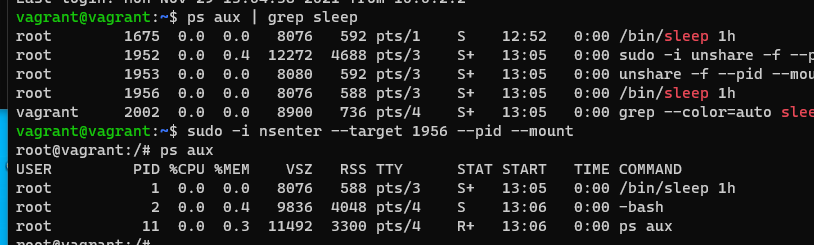

# Домашнее задание к занятию "3.4. Операционные системы, лекция 2"

1. На лекции мы познакомились с [node_exporter](https://github.com/prometheus/node_exporter/releases). 
В демонстрации его исполняемый файл запускался в background. 
Этого достаточно для демо, но не для настоящей production-системы, где процессы должны находиться под внешним управлением. 
Используя знания из лекции по systemd, создайте самостоятельно простой [unit-файл]
(https://www.freedesktop.org/software/systemd/man/systemd.service.html) для node_exporter:

    * поместите его в автозагрузку,
    * предусмотрите возможность добавления опций к запускаемому процессу через внешний файл (посмотрите, например, на `systemctl cat cron`),
    * удостоверьтесь, что с помощью systemctl процесс корректно стартует, завершается, а после перезагрузки автоматически поднимается.

ОТВЕТ:
- установил node_exporter, prometheus, grafana;
- конфигурационный файл node_exporter:
`[Unit]
Description=Node Exporter
After=network-online.target
[Service]
User=node_exporter
Group=node_exporter
Type=simple
ExecStart=/usr/local/bin/node_exporter
[Install]
WantedBy=multi-user.target`

- конфигурационный файл prometheus:
`[Unit]
Description=Prometheus
Wants=network-online.target
After=network-online.target
[Service]
User=prometheus
Group=prometheus
Type=simple
Restart=on-failure
ExecStart=/usr/local/bin/prometheus \
--config.file /etc/prometheus/prometheus.yml \
--storage.tsdb.path /var/lib/prometheus/ \
ExecReload=/bin/kill -HUP $MAINPID
ProtectHome=true
ProtectSystem=full
[Install]
WantedBy=multi-user.target`

- чтобы получать данные от node_exporter ему нужно добавить конфигурацию либо создать отдельный  
`static_configs: - targets: ['localhost:9090', 'localhost:9100']`
либо отдельную секцию
`scrape_configs: - job_name: 'node_exporter'
scrape_interval: 5s
static_configs:
      - targets: ['localhost:9100']` 

-добавил в автозагрузку командами
`systemctl enable node_exporter.service`
`systemctl enable prometheus.service`
- при просмотре статуса командой: `sudo systemctl status node_exporter` должен быть признак enabled
 `Loaded: loaded (/etc/systemd/system/node_exporter.service; enabled; vendor preset: enabled)`
 `enabled` - означает что добавлено в автозагрузку

- перезагрузил службы командой `sudo systemctl daemon-reload`
- проверил статусы все перезапустилось
 
 -добавление опций к запускаемому процессу производится через переменную
`ExecStart=/usr/local/bin/node_exporter $EXTRA_OPTS`

1. Ознакомьтесь с опциями node_exporter и выводом `/metrics` по-умолчанию. 
- curl http://localhost:9100/metrics
Приведите несколько опций, которые вы бы выбрали для базового мониторинга хоста по CPU, памяти, диску и сети.

ОТВЕТ: с опциями ознакомился. Список опций такой:


Чтобы активировать опции, добавляются флаги –collector. <name> при запуске экспортера узлов, например:
`ExecStart=/usr/local/bin/node_exporter --collector.processes --collector.ntp`
- опции по CPU - `ksmd`,  
- памяти - `meminfo_numa`
- диску - `devstat`
- сети - `tcpstat, wifi`

1. Установите в свою виртуальную машину [Netdata](https://github.com/netdata/netdata). 
Воспользуйтесь [готовыми пакетами](https://packagecloud.io/netdata/netdata/install) для установки (`sudo apt install -y netdata`). 
После успешной установки:
    * в конфигурационном файле `/etc/netdata/netdata.conf` в секции [web] замените значение с localhost на `bind to = 0.0.0.0`,
       
    * добавьте в Vagrantfile проброс порта Netdata на свой локальный компьютер и сделайте `vagrant reload`:

    ```bash
    config.vm.network "forwarded_port", guest: 19999, host: 19999
    ```

    После успешной перезагрузки в браузере *на своем ПК* (не в виртуальной машине) вы должны суметь зайти на `localhost:19999`. 
    Ознакомьтесь с метриками, которые по умолчанию собираются Netdata и с комментариями, которые даны к этим метрикам.

ОТВЕТ: netdata установил, конфигурационный файл изменил, проброс настроил, ознакомился.
- также сделал проброс от node_exporter


1. Можно ли по выводу `dmesg` понять, осознает ли ОС, 
что загружена не на настоящем оборудовании, а на системе виртуализации?

ОТВЕТ: можно понять командой `sudo dmesg | grep "Hypervisor detected"`
Если ваша система физическая, вы не увидите никаких выходных данных.
Если ваша система – виртуальная машина, вы увидите результат, подобный приведенному ниже.
`[ 0.000000] Hypervisor detected: KVM`

1. Как настроен sysctl `fs.nr_open` на системе по-умолчанию? Узнайте, что означает этот параметр. 
Какой другой существующий лимит не позволит достичь такого числа (`ulimit --help`)?

ОТВЕТ: Максимальное количество файловых дескрипторов, поддерживаемых ядром, то есть максимальное 
количество файловых дескрипторов, используемых процессом. the maximum number of files that can be opened by process。

просмотреть ограничения:
`ulimit -a` и `ulimit -aH`  
Это быстро покажет текущие "мягкие" и (второй вызов) "жесткие" ограничения
Такие параметры также ограничивают максимальное количество процессов и файлов.
`-n        the maximum number of open file descriptors
-u        the maximum number of user processes
-i        the maximum number of pending signals`

3. Запустите любой долгоживущий процесс (не `ls`, который отработает мгновенно, а, например, `sleep 1h`) 
в отдельном неймспейсе процессов; покажите, что ваш процесс работает под PID 1 через `nsenter`. 
Для простоты работайте в данном задании под root (`sudo -i`). 
Под обычным пользователем требуются дополнительные опции (`--map-root-user`) и т.д.

ОТВЕТ-запущенные слип, с PID 1.



5. Найдите информацию о том, что такое `:(){ :|:& };:`. 

ОТВЕТ: 
Отдельные части команды понятны, что она делает целиком не понятно, образует бесконечный цикл и генерирует подпроцессы.
- : - это эквивалент операции "Nop" (no op, нет операции) (пустая команда). 
Может рассматриваться как синоним встроенной команды true. 
Команда : также является встроенной командой Bash, которая всегда возвращает true
передаем true на stdin следующей команде
- {01..12} фигурные скобки это несколько команда
- & - Вы можете использовать этот оператор для одновременного выполнения нескольких команд.

Запустите эту команду в своей виртуальной машине Vagrant с Ubuntu 20.04 (**это важно, поведение в других ОС не проверялось**). 
Некоторое время все будет "плохо", после чего (минуты) – ОС должна стабилизироваться. 
Вызов `dmesg` расскажет, какой механизм помог автоматической стабилизации. 
Как настроен этот механизм по-умолчанию, и как изменить число процессов, которое можно создать в сессии?

ОТВЕТ- запустил получал ошибку bash: fork: Resource temporarily unavailable

изменить количество процессов:
`ulimit -u` - посмотреть сколько процессов
`sudo ulimit -u 1000` - установить сколько процессов;
-также можно в файле конфигурации
`/etc/security/limits.conf`
 `username hard nproc 25`
`@groupname hard nproc 100`
 ---
