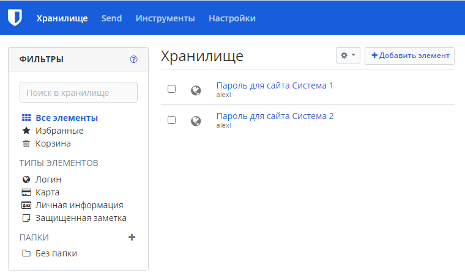
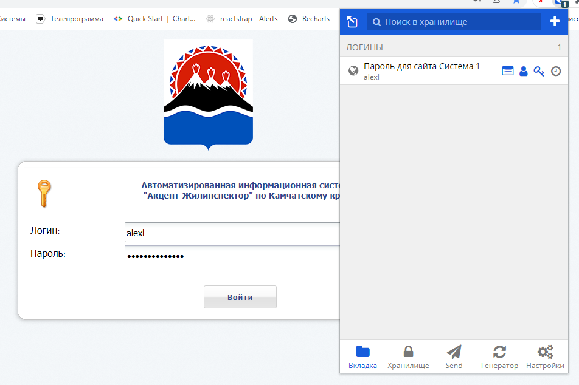
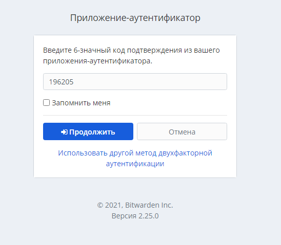
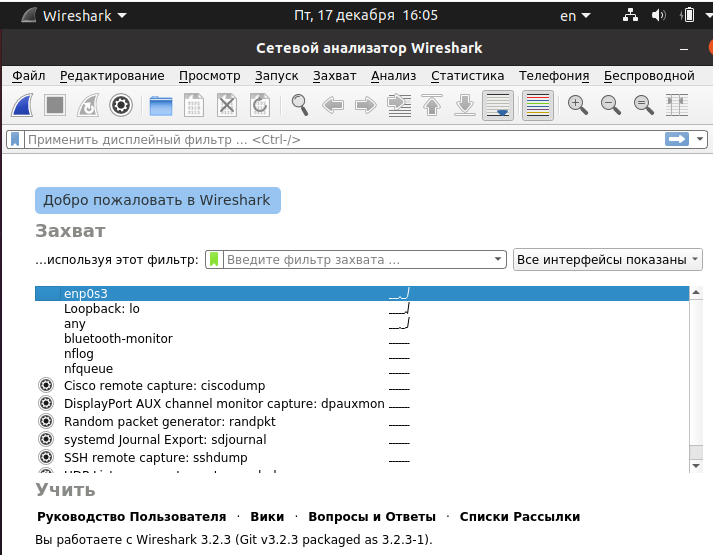

# Домашнее задание к занятию "3.9. Элементы безопасности информационных систем"

1. Установите Bitwarden плагин для браузера. Зарегестрируйтесь и сохраните несколько паролей.

ОТВЕТ: зарегистрировался, добавил два пароля, установил плагин, можно использовать для авторизации.




3. Установите Google authenticator на мобильный телефон. 
Настройте вход в Bitwarden акаунт через Google authenticator OTP.

ОТВЕТ: настроено, запрашивает код из Google authenticator.



5. Установите apache2, сгенерируйте самоподписанный сертификат, 
настройте тестовый сайт для работы по HTTPS.

ОТВЕТ: настроено тестовый сайт.
```bash
используемые команды:
sudo apt update
sudo apt install apache2
sudo systemctl enable apache2
sudo systemctl status apache2
- создание файла конфигурации
- создание содержимого сайта
sudo nano /var/www/test.com/public_html/index.html
cd /etc/httpd - генерировать сертификат
mkdir ssl ; cd ssl - создаем папки для сертификатов
openssl req -new -x509 -days 1461 -nodes -out cert.pem -keyout cert.key 
-subj "/C=RU/ST=SPb/L=SPb/O=Global Security/OU=IT Department/CN=test.dmosk.local/CN=test"
- генерируем сертификат
Установка модуля SSL для Apache
apachectl -M | grep ssl
hostname -I - посмотреть адрес Apache
- активация хоста
sudo a2ensite test.com
apachectl configtest
sudo systemctl reload apache2
``` 
Скриншоты
- Сгенерированные сертификат


- Настроенный https


- Собственный сайт настроенный на hhtps


- Файл конфигурации для собственного сайта


4. Проверьте на TLS уязвимости произвольный сайт в интернете.
ОТВЕТ: постерировал google, yandex, vk
```bash
./testssl.sh -U --sneaky https://www.google.com/
./testssl.sh -U --sneaky https://www.yandex.ru/
./testssl.sh -U --sneaky https://www.vk.com/
```

5. Установите на Ubuntu ssh сервер, сгенерируйте новый приватный ключ. 
Скопируйте свой публичный ключ на другой сервер. 
Подключитесь к серверу по SSH-ключу.

ОТВЕТ: подключился по ключу.
- Подключился к рег ру по ssh


  
7. Переименуйте файлы ключей из задания 5. 
Настройте файл конфигурации SSH клиента, 
так чтобы вход на удаленный сервер осуществлялся 
по имени сервера.

ОТВЕТ: 
До переименования ключей настроил подключение по имени сервера.
- Подключение по имени сервера


- Файл конфигурации для подключения по имени сервера


- Переименовал ключи
```
mv id_rsa id_rsa1
mv id_rsa.pub id_rsa1.pub
отправил на сервер
ssh-copy-id u1553711@31.31.196.218
но при входе по ключу возникает ошибка, при создании ключей 
с нестандартными именами тоже возникает ошибка такая же не смог ее решить
ssh -i ~/.ssh/new_key.pub u1553711@31.31.196.218
vim ~/.ssh/config - настроили файл конфигурации
```
- Ошибка, при использовании ключей с нестандартными именами, которую не смог решить


9. Соберите дамп трафика утилитой tcpdump в формате pcap, 100 пакетов.
 Откройте файл pcap в Wireshark.

ОТВЕТ: 
`команда sudo tcpdump -c 100 -w 0001.pcap -i eth0`
- Установленный Wireshark


- Анализ файла через Wireshark


---