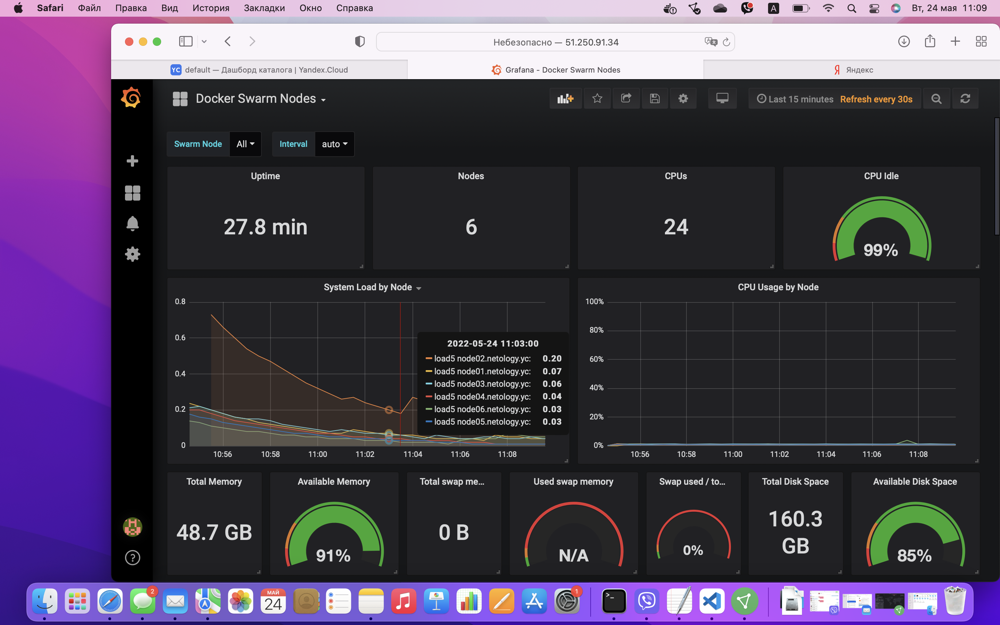

# Домашнее задание к занятию "5.5. Оркестрация кластером Docker контейнеров на примере Docker Swarm"

## Задача 1

Дайте письменые ответы на следующие вопросы:

- В чём отличие режимов работы сервисов в Docker Swarm кластере: replication и global?

В global режиме на каждом узле, удовлетворяющем ограничениям размещения, выполняется ровно одна реплика службы, 
в replication распределяются веером по узлам, но также могут быть размещены на одном узле.
Глобальные сервисы полезны, когда вы хотите создать контейнер на каждом узле вашего кластера. 
replication указывается необходимое количество реплик и кластер обеспечивает данное количество.
Антивирус на каждом сервере или агенты мониторинга. Тогда автоматически на каждом экземпляре.
А отдельные службы в режиме репликации.

- Какой алгоритм выбора лидера используется в Docker Swarm кластере?

Алгоритм голосования и выбора лидера Raft consensus.
Смысл алгоритма обеспечить одинаковое согласованное состояние во всем кластере и перераспределение задач между менеджерами если лидер например выходит из строя.

- Что такое Overlay Network?

Overlay network : Создает внутреннюю частную сеть, которая охватывает все узлы, участвующие в кластере swarm. 
Таким образом, оверлейные сети облегчают обмен данными между сервисом Docker Swarm и автономным контейнером или 
между двумя автономными контейнерами на разных демонах Docker.
Есть мнение, что Overlay сети сильно снижает производительность сети.

## Задача 2

Создать ваш первый Docker Swarm кластер в Яндекс.Облаке

Для получения зачета, вам необходимо предоставить скриншот из терминала (консоли), с выводом команды:
```
docker node ls
```


## Задача 3

Создать ваш первый, готовый к боевой эксплуатации кластер мониторинга, состоящий из стека микросервисов.

Для получения зачета, вам необходимо предоставить скриншот из терминала (консоли), с выводом команды:
```
docker service ls
```





